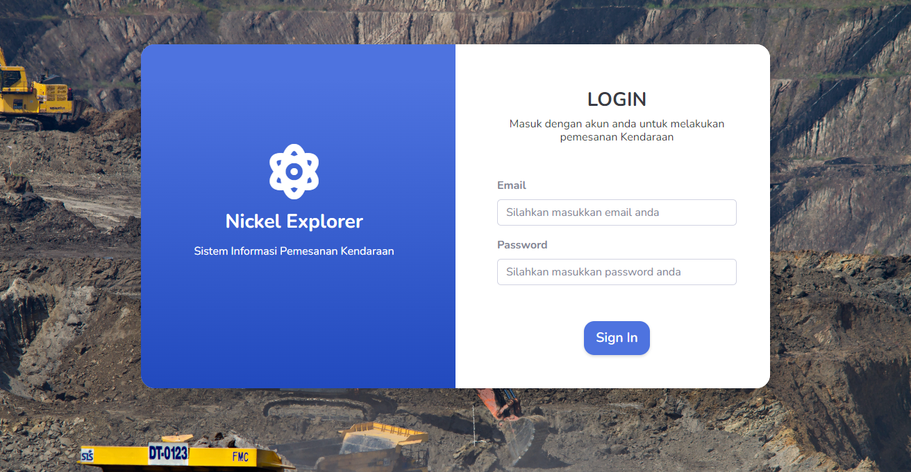
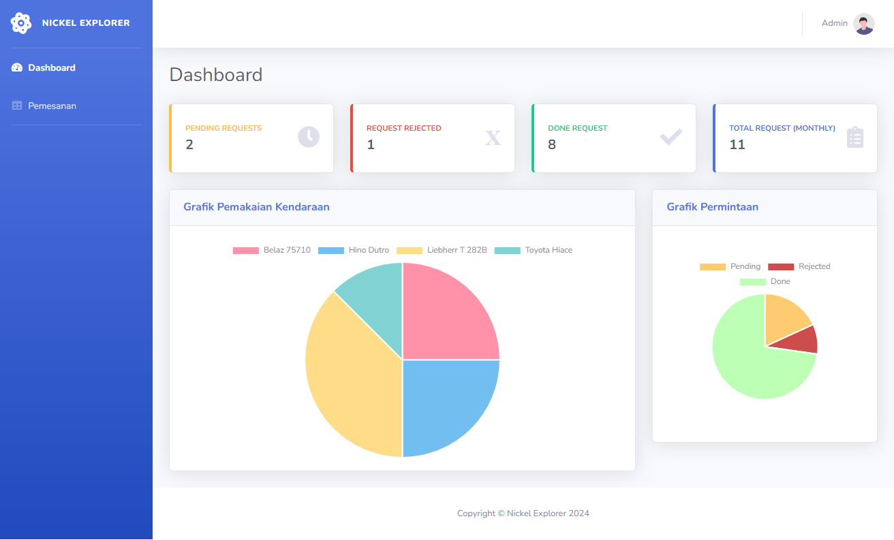
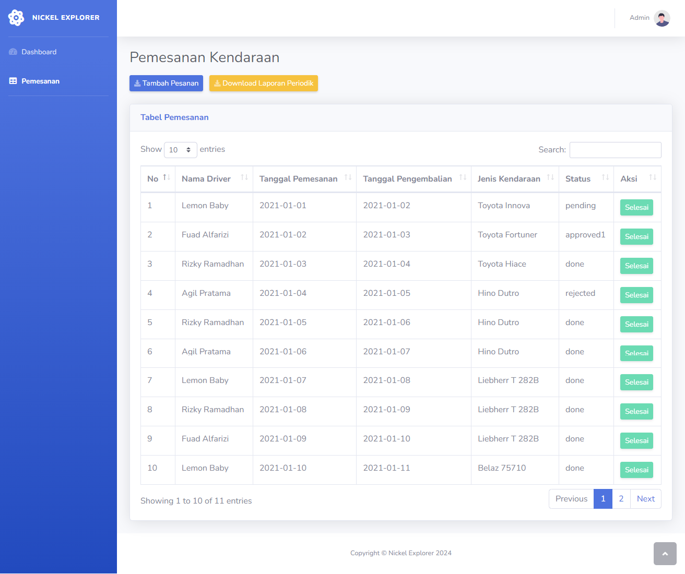
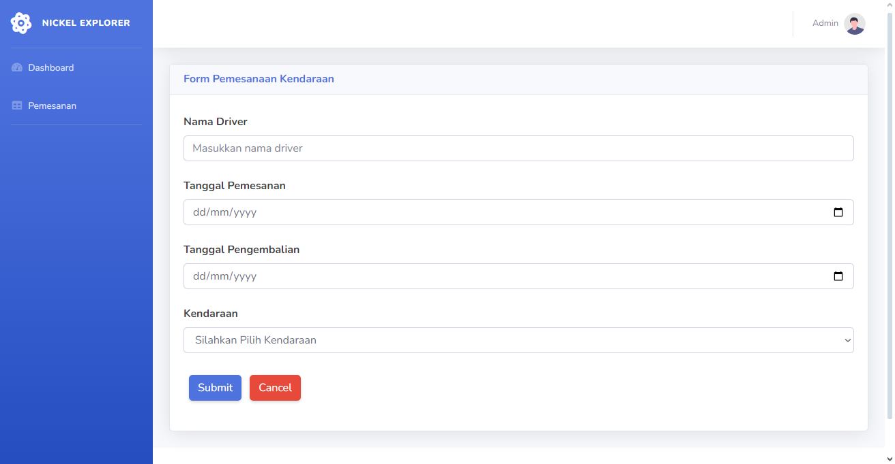
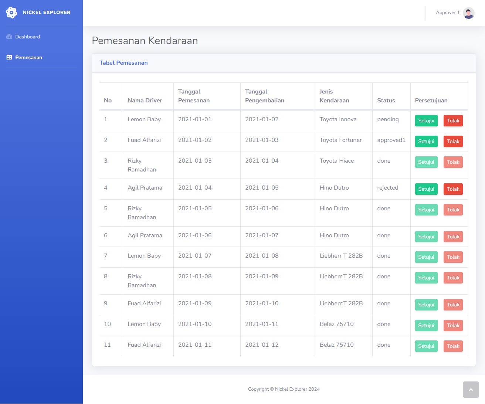

<p align="center">
  <a href="" rel="noopener">
 </a>
</p>

<h2 align="center">Nickel Explorer</h3>

<p align="center"> Aplikasi pemesanan kendaraan perusahaan tambang nikel
    <br> 
</p>

## 📝 Table of Contents
- [About The Project](#about)
- [Fitur Aplikasi](#fitur)
- [Cara Menggunakan](#usage)
- [Tampilan Aplikasi](#tampilan)
- [Database Version](#database-version)
- [PHP Version](#php-version)
- [Framework Version](#framework-version)

## 🧐 About The Project<a name = "about"></a>
Sebuah web aplikasi untuk dapat memonitoring kendaraan yang dimiliki. Untuk dapat memakai kendaraan, pegawai diwajibkan untuk melakukan pemesanan terlebih dahulu ke pool atau bagian pengelola kendaraan dan pemakaian kendaraan harus diketahui atau disetujui oleh masing - masing atasan.

## 🛠 **Fitur Aplikasi** <a name = "fitur"></a>
* Login
* Monitoring Grafik Pemakaian Kendaraan
* Pemesanan Kendaraan
* Persetujuan Pemesanan Kendaraan
* Export laporan periodik pemesanan kendaraan dalam bentuk Excel

## 🎈 Cara Menjalankan <a name="usage"></a>
1. Clone the repository

    ```git clone https://github.com/bintangsholu21/fsd-sekawanmedia-test.git```


2. Switch to the repo folder

    ```cd fsd-sekawanmedia-test```


3. Install all the dependencies using composer

    ```composer install```

4. Copy the example env file and make the required configuration changes in the .env file

    ```cp .env.example .env```

5. Generate a new application key

    ``php artisan key:generate``

6. Run the database migrations

    ```php artisan migrate:fresh --seed```

7. Start run dev
    
    ```npm run dev```

8. Start the local development server

    ```php artisan serve```

<br>
## 📸 **Screenshots** <a name = "tampilan"></a>

* Login Page

   

  
  Tampilan login digunakan pengguna untuk masuk ke akun dengan memasukkan email dan password yang telah didaftarkan.


  #### ADMIN ACCOUNT
  ```admin@gmail.com```
  ```admin```


  #### pprover 1 ACCOUNT
  ```approver1@gmail.com```
  ```password1```


    #### Approver 2 ACCOUNT
    ```approver2@gmail.com```
    ```password2```

<br>


* Dashboard
  
  

 >   Pada halaman dashboard ini, pengguna dapat melihat grafik pemakaian kendaraan yang telah disediakan oleh perusahaan. Grafik ini menampilkan jumlah pemakaian kendaraan per bulan. Pengguna juga dapat melihat jumlah pemesanan kendaraan yang belum disetujui oleh atasan.
 <br>

* Daftar Pemesanan Kendaraan

    

>    Pada halaman ini, pengguna dapat melihat daftar pemesanan kendaraan yang telah dilakukan oleh pegawai. Pengguna juga dapat melakukan pencarian pemesanan kendaraan berdasarkan tanggal pemesanan, nama pegawai, dan status pemesanan.
<br>

* Form Pemesanan Kendaraan

    

>    Pada halaman ini, pengguna dapat melakukan pemesanan kendaraan dengan mengisi form yang telah disediakan. Pengguna dapat memilih jenis kendaraan, tanggal pemesanan, dan keterangan pemesanan. Setelah pengguna mengisi form, pengguna dapat menekan tombol "Submit" untuk melakukan pemesanan kendaraan.

<br>

* Daftar Persetujuan Pemesanan Kendaraan

  

>    Pada halaman ini, pengguna dapat melihat daftar pemesanan kendaraan yang telah dilakukan oleh Approver. Pengguna juga dapat melakukan pencarian pemesanan kendaraan berdasarkan tanggal pemesanan, nama pegawai, dan status pemesanan.


## Database Version <a name="database-version"></a>

* MySQL 5.7

## PHP Version <a name="php-version"></a>

* PHP 7.4

## Framework Version <a name="framework-version"></a>

* Laravel 10.0